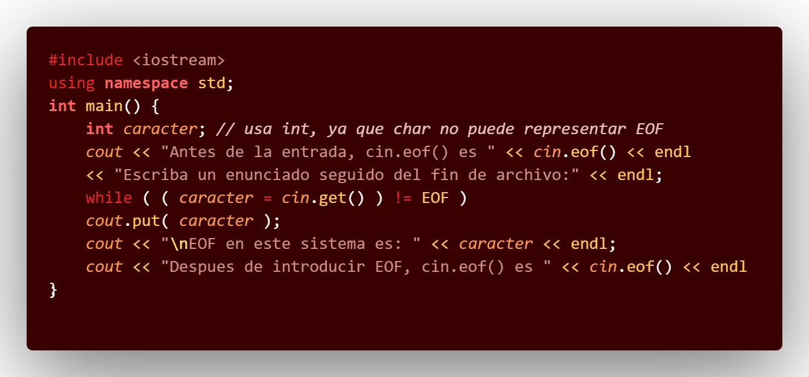
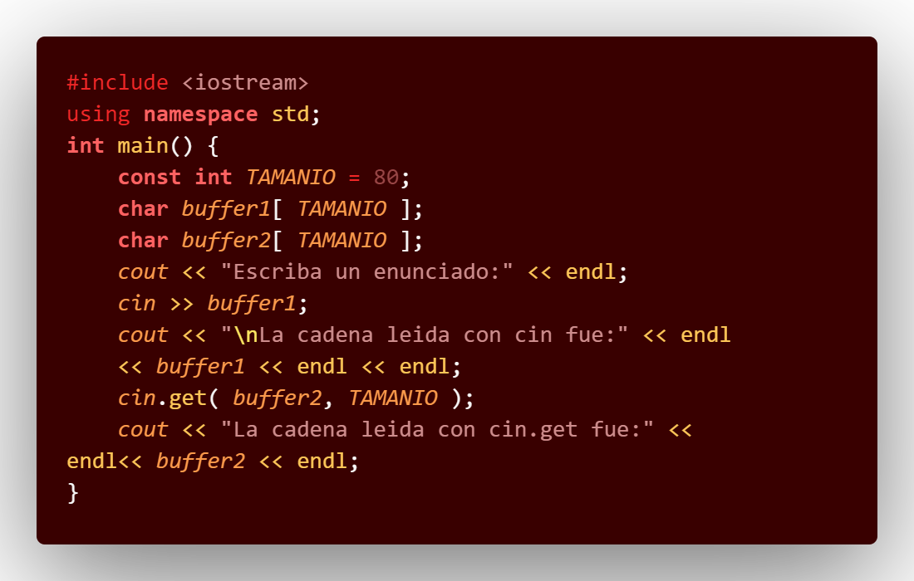
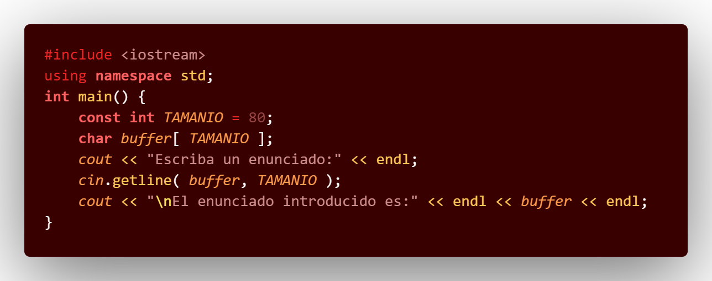
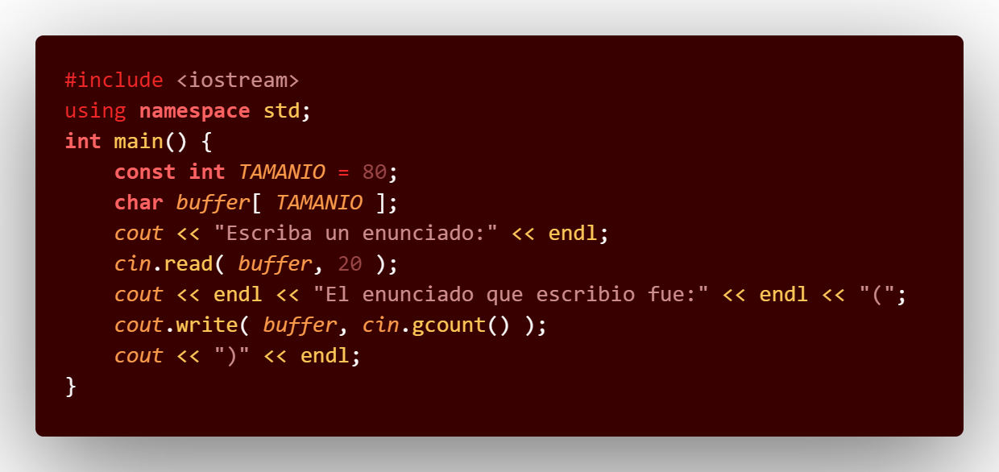
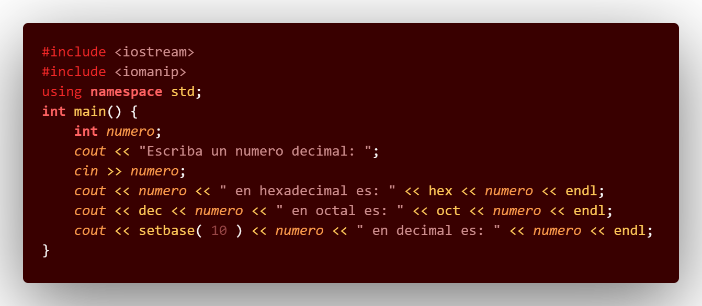

# C_PDC9

## :copyright: Autor

- :camera:  
- :woman: **Mónica Valeria Castillo**
- :e-mail: monicastillo@unitec.edu
- :link: [github.com/monicastle](https://github.com/monicastle)
- :calendar: 13/09/2020

---

## :dart: Objetivos

Punto de Control #09 en **C++** diseñado para demostrar:

1. :nut_and_bolt: El manejo de:
   - **Archivos de Texto**
   - **Archivos Binarios**
2. :books: El uso de la libreria:
   - **NCurses**
3. :open_file_folder:La organización de:
   - Código (**Visual Studio Code** y Repositorio en **Github**)
   - Imágenes (Extensión **Polacode** de **VSC**)
   - Formato (**Markdown** en **VSC**)

---

## :yellow_circle: eof_get_y_put.cpp

## :orange_circle: Salida

---

## :red_circle: cin_y_cin-get.cpp

## :purple_circle: Salida

---

## :yellow_circle: cin-getline.cpp

## :orange_circle: Salida

---

## :red_circle: read_y_write.cpp

## :purple_circle: Salida

---

## :yellow_circle: dec_oct_hex_y_setbase.cpp

## :orange_circle: Salida

---

## :red_circle: Precision.cpp

## :purple_circle: Salida

---

## :computer: Código

- :blue_book: [C_PDC9](https://github.com/monicastle/C_PDC9)

---
## :wrench: Herramientas
- :package: [Visual Studio Code](https://code.visualstudio.com/)
- :camera: [Polacode-2020 v0.5.2](https://github.com/jeff-hykin/polacode)
- :notebook: [Markdown Cheatsheet](https://github.com/adam-p/markdown-here/wiki/Markdown-Cheatsheet)
- :smile: [Emoji Cheat Sheet](https://www.webfx.com/tools/emoji-cheat-sheet/)
